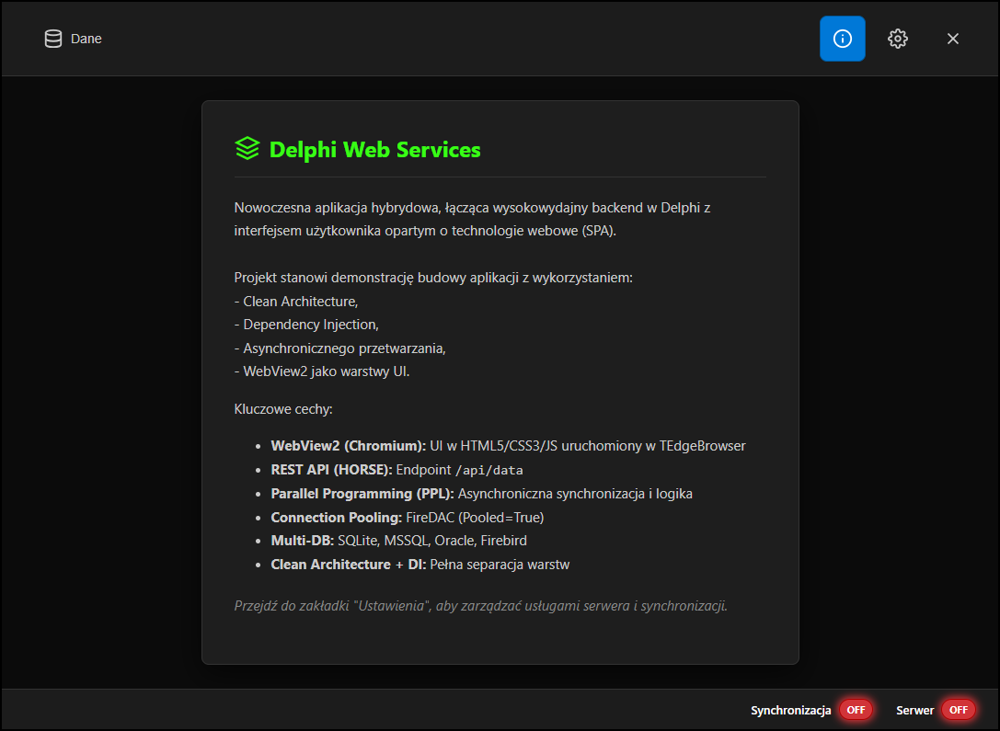
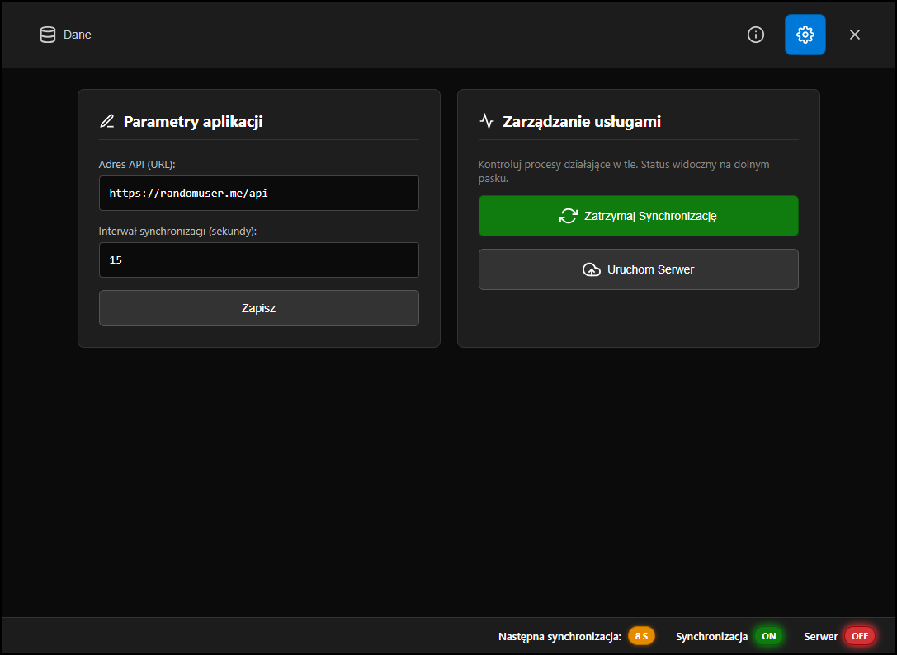
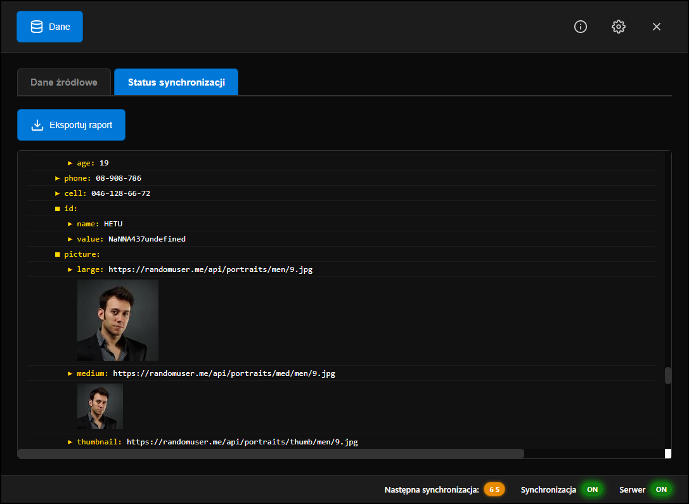
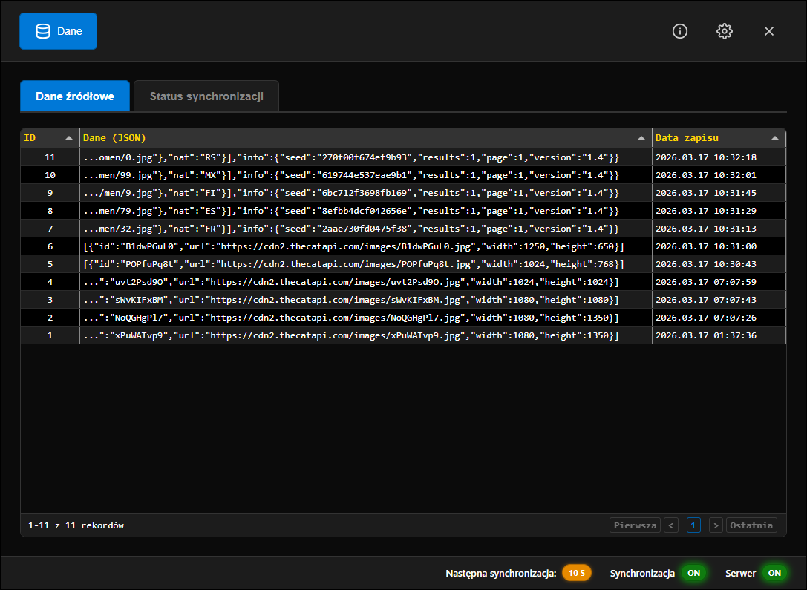
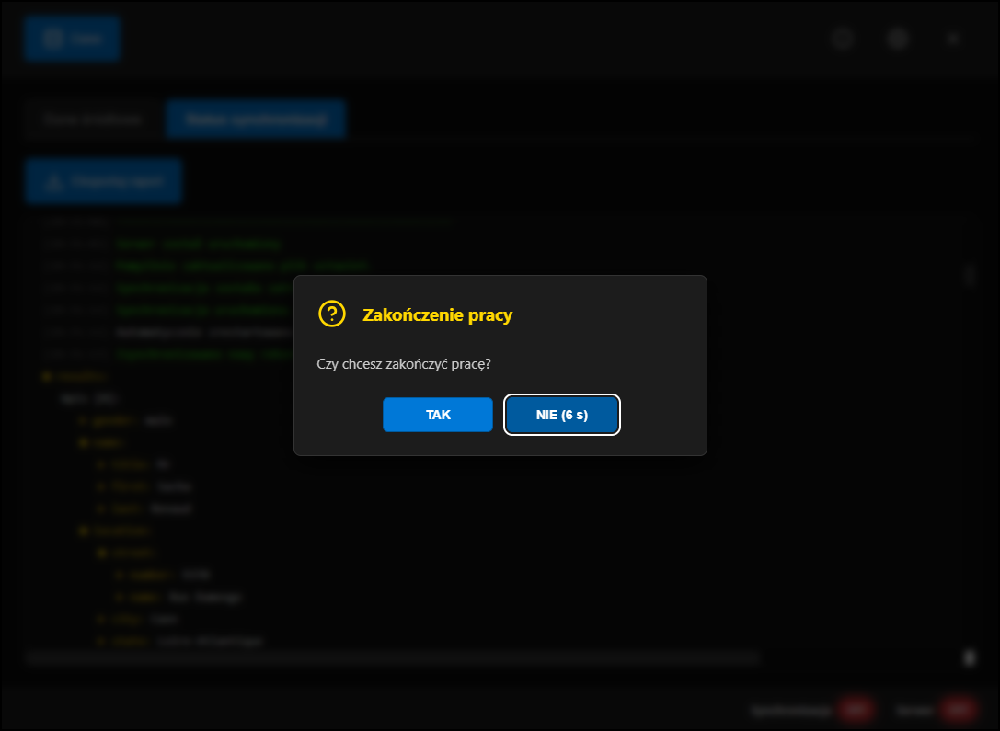

# Delphi Web Services

Nowoczesna aplikacja hybrydowa, łącząca wysokowydajny backend w Delphi z interfejsem użytkownika opartym o technologie webowe (SPA).

Projekt stanowi demonstrację budowy aplikacji z wykorzystaniem:
- Clean Architecture,
- Dependency Injection,
- Asynchronicznego przetwarzania,
- WebView2 jako warstwy UI.

---

## Kluczowe cechy

- **Hybrid UI (SPA)**  
  Interfejs zbudowany w HTML5/CSS3/JS osadzony w `TEdgeBrowser` (WebView2)

- **Dwukierunkowa komunikacja (JS <-> Delphi)**  
  Asynchroniczność oparta o JSON i zdarzenia

- **REST API (HORSE)**  
  Lekki i szybki serwer HTTP do udostępniania danych (`/api/data`)

- **Wielowątkowość (PPL + TThread)**  
  Operacje sieciowe i synchronizacja danych bez blokowania UI

- **Obsługa wielu baz danych**
  - SQLite (WAL)
  - Firebird
  - MS SQL Server
  - Oracle

- **Connection Pooling (FireDAC)**  
  Wysoka wydajność dzięki `FDManager` (`Pooled=True`)

- **Clean Architecture + DI**  
  Pełna separacja warstw i łatwa wymienialność implementacji

---

## Diagram Architektury

Poniższy schemat przedstawia przepływ danych i zależności w aplikacji:

```text
            +--------------------------------------------------+
            |            HYBRID UI (SPA - WebView2)            |
            |        HTML5 / CSS3 / JavaScript (Tabulator)     |
            +-------------------------+------------------------+
                                      | 
                        WebMessageReceived (JS→Delphi)
                                      |
                                      v
+----------------+    +-------------------------------+    +----------------+
|  IAppLogger    |<---|   VCL Controller (Main Form)  |--->|   IAppConfig   |
| (Logi systemu) |    |      TEdgeBrowser Host        |    | (config.json)  |
+----------------+    +---------------+---------------+    +----------------+
                                      |
                         ExecuteScript (Delphi→JS)
                                      |
                                      v
                    +-----------------+------------------+
                    |      KONTENER DI (TContainer)      |
                    |  (IoC, zarządzanie zależnościami)  |
                    +--------+-------------------+-------+
                             |                   |
                             |                   |
                +------------v--+      +---------v-----------+
                |  Sync Worker  |      |   REST ApiClient    |
                | (TThread/PPL) |      |   (THTTPClient)     |
                +------------+--+      +---------+-----------+
                             |                   |
                             +---------+---------+
                                       |
                                       v
                       +-------------------------------+
                       |        IDatabaseManager       |
                       |      (FireDAC + Pooling)      |
                       +--+-------+---------+-------+--+
                          |       |         |       |
                    +-----v--++---v- --++---v--++---v-----+
                    | SQLite || Oracle || MSSQL|| Firebird|
                    +--------++--------++------++---------+
                                       ^
                                       |
                      +----------------+----------------+
 HTTP GET /api/data   |   Framework HORSE (REST API)    |   JSON Response
--------------------->|                                 |------------------>
                      +---------------------------------+

---

## Demo









